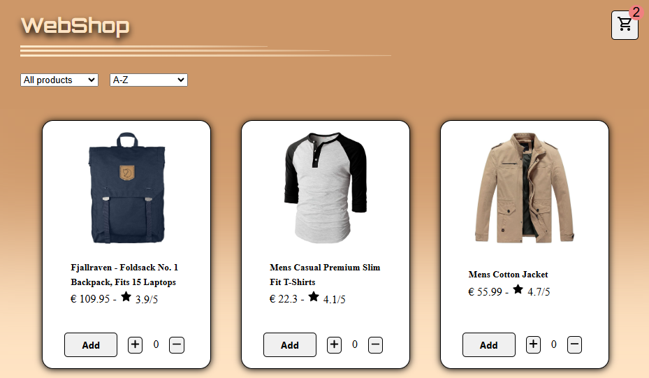
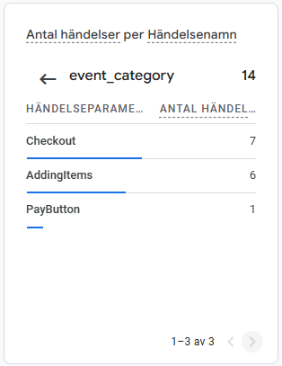

# Webbshoppen

## Grupp 6
- Antonio
- Aleksandar
- Niklas
- Illia
- Baker

The link to the Shop can be found deployed on [GitHub Pages](https://makiwebdeveloper.github.io/webbshoppen/).

The link to our Github repository's [Github Repo](https://github.com/makiwebdeveloper/webbshoppen).

## Overview
This is a interactive webbshop that gives a user possibility to purchase products of different categories. Furthermore a user, to find relevant products, can choose to sort products by category and simultaneously sort by name, rating and price high to low or vice versa. Once finished shopping, user can go to the shopping cart to complete with customer information to finalize the purchase order.

## Technologies Used
- HTML: For structuring the website.
- CSS: For styling and responsive design.
    - Media Queries: For ensuring that the shop works on different devices.
- Javascript: For dynamic and interactive behaviour.
    - Using Async function to fetch API.
    - Render products with map() function,
    - Filter products using Filter() function,
    - Sort products using sort() function,
    - Reduce function to sum total sum
    - Localstorage to save products to shopping cart,
    - Clear localstorage using reset.
    - using emailjs for the customer/delivery form.

**GTAG**

We've added 3 different custom events that tracks how many clicks are made on following buttons:

- PayButton:
This event register clicks on Pay-button, this can help us to track how many finalize their shopping orders.

- Checkout:
This event register clicks on Checkout button, the checkbutton leads to a form for user to insert information for delivery. This will help us understand to track how many users that checksout but do not finalize their order. We can use this data to identify possible issues and develop into better user experience.

- AddingItems:
This event register how many clicks that are made when changing quantity on products that potential customer wants.

## Possibilities and limitations with event tracker

Event Tracking in Javascript gives us the possibility to handle user interaction and dynamics of website content. We can handle a wide range of events from mouse, keyboard, forms, windows, media, that includes clicks, doubleclick, mousemove, keypress, submit scrolling, play, stop etc. and more. This gives us a great understanding with posibility to develop our website to a more interactive and dynamic website.

While event tracking gives us a better understanding and possibility to develop user interaction, event tracking also comes with limitations such as performance issue. This can happen if we dont manage eventhandlers properly, especially events that propogate through the DOM hieracrhy (bubbling or capturing).

## Disadvantages
- Limited interaction for users.
- No commercials.

## Future improvements
- Add more products and categories.
- Add a search bar.
- More modern design & better color contrast.
- develop a better user experience.
- Add commercials.
